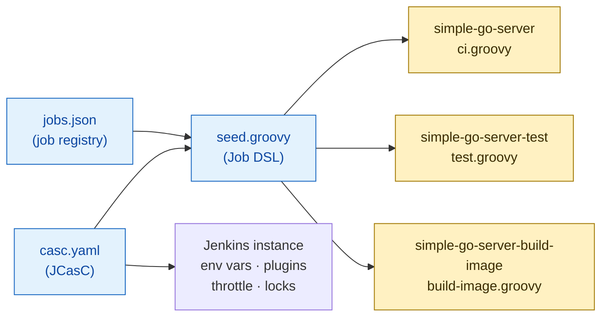

# CI Pipeline for Go Microservices

Jenkins CI pipeline for the sample Go web server, designed for a five-node
build fleet and built to scale across multiple repositories.

```
ci/
├── pipelines/              # pipeline definitions (one file = one Jenkins job)
│   ├── ci.groovy           #   full CI orchestrator (auto-triggered)
│   ├── test.groovy         #   lint + unit test (manual / sub-job)
│   └── build-image.groovy  #   build production image (manual / sub-job)
├── shared-library/         # reusable steps shared across pipelines
│   └── vars/ecrPush.groovy #   ECR authentication + push
└── local-jenkins/          # docker-compose smoke-test environment
    ├── casc.yaml           #   Jenkins infrastructure (JCasC): agents, env vars, throttle
    ├── seed.groovy         #   reads jobs.json, creates Jenkins jobs
    ├── jobs.json           #   job registry (add a service = add a JSON entry)
    ├── Dockerfile          #   Jenkins master (0 executors, orchestration only)
    └── Dockerfile.agent    #   build agent (5 executors, docker CLI, SSH)
```

Application source (`main.go`, `Dockerfile`, `Dockerfile.test`) is unchanged.

---

## Job Provisioning

How Jenkins jobs are created from config. This runs once at setup (or when
`jobs.json` changes), not on every commit.



- Adding a new service = add one entry to `jobs.json`. `seed.groovy` is generic and never needs to change.
- The CI orchestrator is a **Multibranch Pipeline** — it auto-discovers branches, PRs, and tags. New branches trigger CI automatically.
- The standalone sub-jobs (`test`, `build-image`) are regular pipeline jobs for manual use.

---

## CI Pipeline Flow

What happens when a developer pushes code. The orchestrator (`ci.groovy`)
calls sub-jobs, each independently runnable for quick feedback.


Sub-jobs (`test`, `build-image`) can be triggered independently by developers
for quick iteration without running the full pipeline. Resource contention
controls (throttle, lock, executor limits) are applied inside each sub-job —
see [Design Decisions §1](#1-resource-contention) for details.

---

## Design Decisions

### 1. Resource Contention

5 nodes, each with 5 executors (headroom above the 3+ concurrent minimum).
Executors control general job concurrency; throttle and lock control docker
daemon contention specifically:

| Scope | Mechanism | Effect |
|---|---|---|
| **Cluster** | `throttle(['docker-build'])` | Caps total simultaneous docker-build jobs across all 5 agents |
| **Per-node** | `lock("docker-${NODE_NAME}")` | Serializes docker daemon access on the same agent |
| **Per-job** | `disableConcurrentBuilds(abortPrevious: true)` | Same PR pushed 3x in a minute: only the latest build runs |
| **Time** | `timeout(time: 30, unit: 'MINUTES')` | Stuck builds can't pin an executor forever |

Post-build cleanup (`docker image prune` + `cleanWs()`) prevents disk
exhaustion, which silently takes nodes offline.

### 2. Scalability

The pipeline is split into three layers, each scaling independently:

| Layer | What | How to extend |
|---|---|---|
| **Job registry** (`jobs.json` + `seed.groovy`) | Which repos get which pipelines | Add a JSON entry — no code changes |
| **Pipelines** (`ci/pipelines/`) | Pipeline definitions and stage orchestration | Add a `.groovy` file (e.g. `cd.groovy`, `security-scan.groovy`) |
| **Shared library** (`ci/shared-library/`) | Reusable steps (ECR push, future: Slack notify, Trivy scan) | Add a `vars/*.groovy` — all pipelines can call it |

Sub-job pattern ensures zero duplication: `test.groovy` is the single source
of truth for testing logic, used by both the CI orchestrator and developers
running it standalone.

Infrastructure settings (registry, region, IAM role) are Jenkins global env
vars (`CI_*`) set via JCasC. Pipelines read them at runtime — no
hardcoded infrastructure values in pipeline code.

### 3. Tagging Strategy

Every build produces a Docker image tagged with the **git short SHA**
(e.g. `a2601ef`). This tag is immutable — it always points to exactly one
commit and never gets overwritten.

On top of the SHA tag, the push stage adds a human-friendly alias depending
on context:

- **Push to `main`** → image is tagged `a2601ef` + `latest`, both pushed to ECR.
  `latest` is a moving tag that always points to the newest main build.
- **PR or feature branch** → image is tagged `a2601ef` but **not pushed**.
  The build proves the Dockerfile works without polluting the registry.

Git tags (`v1.2.3`) are used as release records after the fact — the image
is already built and pushed by the time a tag is created. No rebuild needed.

Production deployments always reference the SHA tag (e.g. `a2601ef`), never
`latest`. This guarantees deterministic rollback — re-deploying a previous
SHA gives you exactly that commit, no ambiguity.

### 4. Security

**Zero long-lived AWS credentials.** The auth chain:

```
EC2 instance profile (JenkinsAgentRole)
  → sts:AssumeRole into ECR account (15-min session)
    → aws ecr get-login-password | docker login --password-stdin
      → docker push → docker logout in finally block
```

- No `AWS_ACCESS_KEY_ID` in Jenkins. IAM instance profile only.
- `ecrPush()` uses `withAWS(role: ..., duration: 900)` for cross-account.
- ECR token piped via `--password-stdin`; never written to disk or logs.
- `docker logout` runs in `finally` regardless of build outcome.

---

## Local Verification

```bash
cd ci/local-jenkins
docker compose up --build
# Jenkins:        http://localhost:8080   (admin / admin)
# Blue Ocean:     http://localhost:8080/blue
# Local registry: http://localhost:5000
```

The local environment mirrors production architecture:

```
docker compose up
├── jenkins       master (0 executors — orchestration only)
├── agent-1       build agent (5 executors — runs all jobs)
└── registry  stand-in for ECR
```

Master connects to the agent via SSH (key pair auto-generated at startup).
Jobs are auto-created from `jobs.json` via `seed.groovy`. The Multibranch
Pipeline auto-discovers branches and triggers CI for each.

Config files (`casc.yaml`, `seed.groovy`, `jobs.json`) are bind-mounted into
the container, so changes take effect on restart without losing build records:

```bash
# Edit config, then:
docker compose restart jenkins agent   # build records preserved

# Or reload JCasC without restarting:
curl -X POST -u admin:admin http://localhost:8080/configuration-as-code/reload
```

Optional: pass a GitHub PAT for API integration (without it, Jenkins falls
back to `pollSCM`):

```bash
export GITHUB_PAT=ghp_xxx
docker compose up --build
```

---

## Future Work

- **GitHub status checks**: post test results back to GitHub via the GitHub plugin, so PRs show pass/fail status and branch protection can require CI to pass before merge
- **Builder isolation**: Kaniko / Buildah instead of socket-bind for production
- **Image scanning**: Trivy gate as a shared library step between build and push
- **Notification routing**: Slack for `main` failures, PR comment for PR failures
- **Multi-arch**: `docker buildx` for amd64 + arm64
