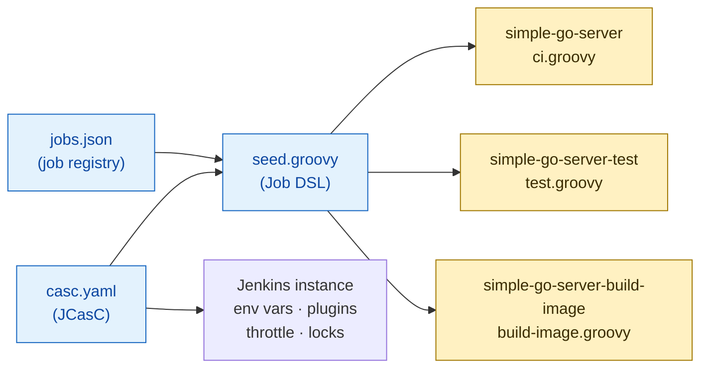
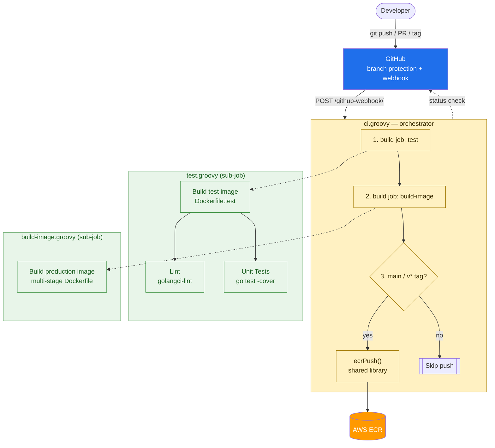

# CI Pipeline for Go Microservices

Jenkins CI pipeline for the sample Go web server, designed for a five-node
build fleet and built to scale across multiple repositories.

```
ci/
├── pipelines/              # pipeline definitions (one file = one Jenkins job)
│   ├── ci.groovy           #   full CI orchestrator (auto-triggered)
│   ├── test.groovy         #   lint + unit test (manual / sub-job)
│   └── build-image.groovy  #   build production image (manual / sub-job)
├── shared-library/         # reusable steps shared across pipelines
│   └── vars/ecrPush.groovy #   ECR authentication + push
└── local-jenkins/          # docker-compose smoke-test environment
    ├── casc.yaml           #   Jenkins infrastructure config (JCasC)
    ├── seed.groovy         #   reads jobs.json, creates Jenkins jobs
    └── jobs.json           #   job registry (add a service = add a JSON entry)
```

Application source (`main.go`, `Dockerfile`, `Dockerfile.test`) is unchanged.

---

## Job Provisioning

How Jenkins jobs are created from config. This runs once at setup (or when
`jobs.json` changes), not on every commit.



Adding a new service = add one entry to `jobs.json`. `seed.groovy` is generic
and never needs to change.

---

## CI Pipeline Flow

What happens when a developer pushes code. The orchestrator (`ci.groovy`)
calls sub-jobs, each independently runnable for quick feedback.



Sub-jobs (`test`, `build-image`) can be triggered independently by developers
for quick iteration without running the full pipeline. Resource contention
controls (throttle, lock, executor limits) are applied inside each sub-job —
see [Design Decisions §1](#1-resource-contention) for details.

---

## Design Decisions

### 1. Resource Contention

5 nodes, peak hours 3+ concurrent jobs per node. Four complementary controls:

| Scope | Mechanism | Effect |
|---|---|---|
| **Cluster** | `throttle(['docker-build'])` | Caps total simultaneous docker-build jobs across all 5 agents |
| **Per-node** | `lock("docker-${NODE_NAME}")` | Serializes docker daemon access on the same agent |
| **Per-job** | `disableConcurrentBuilds(abortPrevious: true)` | Same PR pushed 3x in a minute: only the latest build runs |
| **Time** | `timeout(time: 30, unit: 'MINUTES')` | Stuck builds can't pin an executor forever |

Post-build cleanup (`docker image prune` + `cleanWs()`) prevents disk
exhaustion, which silently takes nodes offline.

### 2. Scalability

The pipeline is split into three layers, each scaling independently:

| Layer | What | How to extend |
|---|---|---|
| **Job registry** (`jobs.json` + `seed.groovy`) | Which repos get which pipelines | Add a JSON entry — no code changes |
| **Pipelines** (`ci/pipelines/`) | What stages run and in what order | Add a `.groovy` file (e.g. `cd.groovy`, `security-scan.groovy`) |
| **Shared library** (`ci/shared-library/`) | Reusable steps (ECR push, future: Slack notify, Trivy scan) | Add a `vars/*.groovy` — all pipelines can call it |

Sub-job pattern ensures zero duplication: `test.groovy` is the single source
of truth for testing logic, used by both the CI orchestrator and developers
running it standalone.

Infrastructure settings (registry, region, IAM role) are Jenkins global env
vars (`RUCKUS_*`) set via JCasC. Pipelines read them at runtime — no
hardcoded infrastructure values in pipeline code.

### 3. Tagging Strategy

Every image gets an **immutable git SHA tag** as its primary identifier:

| Context | Tags | Pushed? |
|---|---|---|
| `main` push | `<sha>`, `latest` | Yes |
| `v1.2.3` tag | `<sha>`, `v1.2.3` | Yes |
| PR / feature branch | `<sha>` only | No — build-only, proves the Dockerfile works |

Production deployments always pin to the SHA tag for deterministic rollback.
OCI labels (`org.opencontainers.image.revision`, `.source`) are baked in for
traceability via `docker inspect`.

### 4. Security

**Zero long-lived AWS credentials.** The auth chain:

```
EC2 instance profile (JenkinsAgentRole)
  → sts:AssumeRole into ECR account (15-min session)
    → aws ecr get-login-password | docker login --password-stdin
      → docker push → docker logout in finally block
```

- No `AWS_ACCESS_KEY_ID` in Jenkins. IAM instance profile only.
- `ecrPush()` uses `withAWS(role: ..., duration: 900)` for cross-account.
- ECR token piped via `--password-stdin`; never written to disk or logs.
- `docker logout` runs in `finally` regardless of build outcome.

---

## Local Verification

```bash
cd ci/local-jenkins
docker compose up --build
# Jenkins:  http://localhost:8080  (admin / admin)
# Registry: http://localhost:5000
```

One node with 3 executors (exercises concurrency), local `registry:2` instead
of ECR. Jobs are auto-created from `jobs.json` via `seed.groovy`.

---

## Future Work

- **Builder isolation**: Kaniko / Buildah instead of socket-bind for production
- **Image scanning**: Trivy gate as a shared library step between build and push
- **Notification routing**: Slack for `main` failures, PR comment for PR failures
- **Multi-arch**: `docker buildx` for amd64 + arm64
